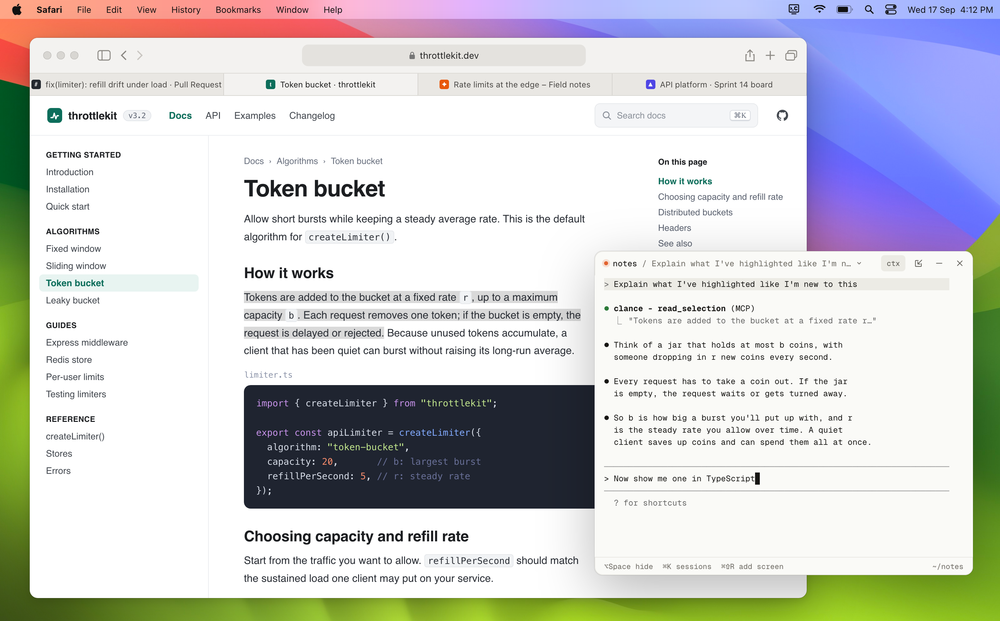
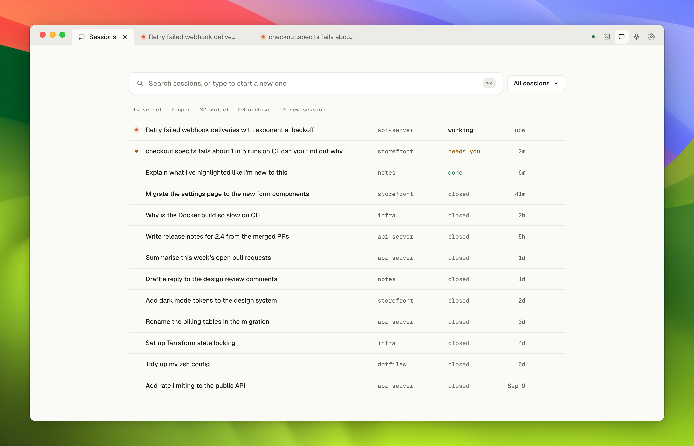
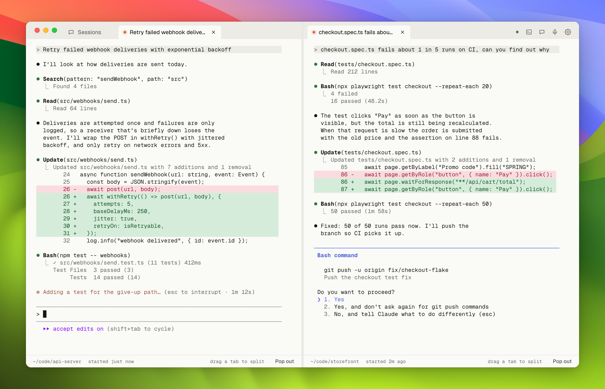
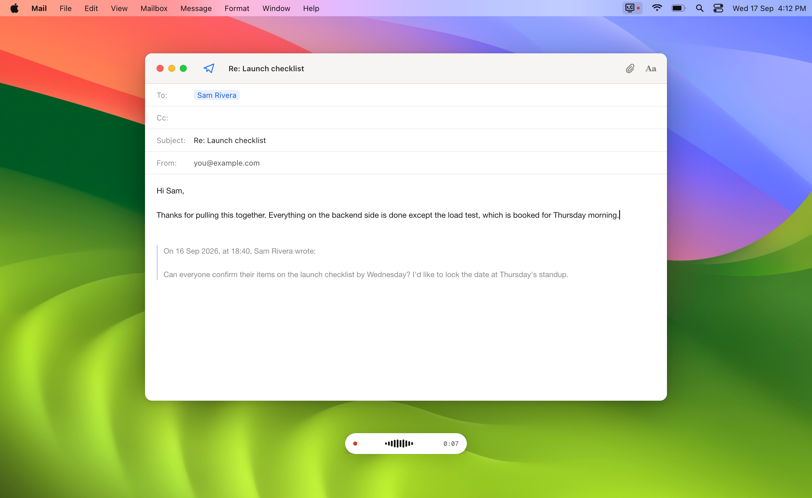

# Clance

Claude Code, one hotkey away, anywhere on your Mac.



Press **⌥Space** in any app and a small floating terminal opens with a fresh
Claude Code session. It's the real `claude` CLI — your skills, MCP servers and
settings included — with extra tools to see your screen, read what you've
highlighted, and type or click in the app you were using.

Press **⌥D** anywhere to dictate. Clance transcribes on your Mac and types
the text at your cursor.

## Features

- **A popup that stays out of the way.** Opens instantly near the cursor,
  can be moved and resized, and hides until you call it back. Nothing about
  your screen is captured unless a session asks for it.
- **Computer-use tools.** Sessions can read your screen as text — the window
  in front of you, the field you're typing in, whatever you've highlighted —
  or take a screenshot when a picture is what's needed. They can also list
  open apps, click a control by the name shown on it, and type into other
  apps. Anything that could act on an app you didn't point at goes through
  Claude Code's normal approval prompt, and each tool can be switched off.
- **Every session in one place.** The main window lists every Claude Code
  session on your Mac — running or finished, from any project. Peek at one
  without opening it, pin the ones you're living in, or open them as terminal
  tabs you can split into panes. Sessions run as Claude Code background
  agents, so closing a window never ends one, and each can be resumed with
  `claude --resume` in a terminal.
- **Read the code your sessions write.** A Changes pane shows what has moved
  in a git repository and updates as files change on disk, so a session
  working in it is watched rather than checked on. A Files explorer browses
  any folder on your Mac, repository or not. Open any file as a tab to read
  it whole, syntax highlighted, with its changes marked in place, then stage,
  commit and push from the same pane. Clance never edits a file — the session
  does that.
- **On-device dictation.** Works in any app, powered by
  [whisper.cpp](https://github.com/ggml-org/whisper.cpp). Clance recommends a
  speech model for your Mac, and keeps a searchable history of everything
  you've dictated.
- **Works with your Claude Code setup.** Skills, hooks, plugins and MCP
  servers you've configured for Claude Code work in Clance unchanged.







## Requirements

- An Apple Silicon Mac on macOS 13 (Ventura) or later
- [Claude Code](https://code.claude.com/docs/en/setup), installed and signed in
- [Homebrew](https://brew.sh)

## Install

```sh
brew install --cask damiensmith1/tap/clance
```

This also installs `whisper.cpp` for dictation. To upgrade later, run
`brew upgrade --cask clance`. Settings → Check for Updates tells you when a
new release is out.

Clance isn't notarized by Apple. Releases are signed with the project's own
certificate, and the cask removes macOS's quarantine flag after install so
Clance opens normally. Installing from this tap is what you're trusting.

## First launch

A short setup walks you through signing in to Claude, granting permissions,
choosing shortcuts and, optionally, setting up dictation.

| Permission | What it's for | Required |
|---|---|---|
| Accessibility | Typing, clicking and reading selections in other apps; pasting dictation | Yes |
| Screen Recording | Screenshots (`look_at_screen`) | No |
| Microphone | Dictation | Only for dictation |

If Clance is switched on in System Settings but still reported as not
granted, remove it from that list with **−** and grant it again. macOS only
adds Clance to the Screen Recording list once; if it's missing, add it with
**+**.

## Using Clance

From anywhere on your Mac:

| Shortcut | Action |
|---|---|
| ⌥Space | Open a new conversation in the popup (press again to hide it) |
| ⌥D | Start or stop dictation |
| Esc, while dictating | Cancel |

Both global shortcuts can be changed in Settings. The dictation shortcut is
only claimed once you've installed a speech model.

The popup's toolbar can resume a past session (**Open in…**), move the
conversation into the main window (**Open in App**), **Hide** it with the
session still running, or **Close** it. Drop a file onto any terminal to
paste its path.

Open the main window from the Dock icon or the menu-bar icon. It opens
Sessions, Changes, Files, Dictation and Settings as tabs, which you can split
into panes by dragging one to an edge. Changes and Files open in a pane
beside your work rather than over it.

| Shortcut | Action |
|---|---|
| ⌘K | Search every session on your Mac, or start a new one |
| ⌘P | Open a file in the current repository by name |
| ⌘N | New session |
| Space | Peek at the selected session without opening it |
| ⌘⌫ | Archive the selected session, or stop it if it's running |
| ⌘W / ⌃⇥ | Close the active tab / move between tabs |

## Privacy

- Your screen is read only when a session calls a screen tool. Nothing is
  captured in the background, and password fields are never readable.
- Audio is transcribed on your Mac and deleted afterwards. Transcripts stay
  in `~/.clance/dictation.db`.
- Clance's own network requests are speech model downloads (Hugging Face)
  and update checks (GitHub), when you ask for them. Conversations go through
  the Claude Code CLI, as they would in a terminal.
- There is no telemetry. Clance's data lives in `~/.clance/`; session
  transcripts are Claude Code's own, in `~/.claude/projects/`.

## Building from source

```sh
git clone https://github.com/damiensmith1/clance.git
cd clance
npm install
npm start
```

`npm start` runs Clance with Electron's development binary. That's fine for
UI work, but macOS doesn't keep permission grants reliably for it. For
anything that needs Accessibility, Screen Recording or the microphone, build
and install the app instead:

```sh
sh scripts/create-signing-cert.sh   # once — keeps permissions across rebuilds
npm run dev:packaged                # build, install to /Applications, relaunch
```

Without the certificate, builds are signed ad hoc and macOS forgets their
permissions on every rebuild. Dictation also needs `brew install whisper.cpp`.

There's no test suite yet; `npm run build` type-checks the main process.

## Documentation

- [Background](docs/background.md) — what Clance is and why it's built this way
- [Requirements](docs/requirements.md) — what it does
- [Design](docs/design.md) — how it works

## Contributing

See [CONTRIBUTING.md](CONTRIBUTING.md). Report security issues privately, as
described in [SECURITY.md](SECURITY.md).

## License

[MIT](LICENSE)
